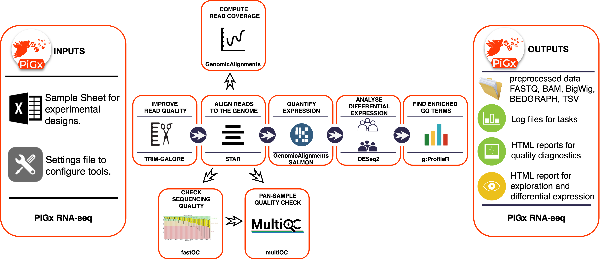

# PiGx RNA-seq

# Introduction
PiGx RNAseq is a preprocessing and analysis pipeline. It takes single-end or paired-end `fastq` files containing fragment reads, and does all the necessary preprocessing to get analysis-ready gene expression levels. It also performs quality control steps and outputs comprehensive quality statistics. Finally, it performs a differential expression analysis and outputs a stand-alone HTML report with tables and figures summarizing any differential gene expression between samples as specified in the experiment design.

## The workflow
PiGx RNAseq follows academic best practices for preprocessing and analysis of RNAseq data. Figure 1 provides an overview of the different steps of the pipeline, as well as the outputs.

First, raw reads are trimmed using [TrimGalore!][trimgalore] to ensure a minimum read quality, and removal of adapter sequences. Next, reads are aligned to a reference genome using [STAR][star], and the depth of coverage is computed using [BEDTools][bedtools], outputing `bedgraph` files. Gene-level expression counts is obtained from _STAR_, and transcript-level quantification is produced using [Salmon][salmon]. Statistical analysis for differential expression analysis is performed using [DESeq2][deseq2], and the results are used to compile a custom report.


_Figure 1: An overview of the PiGx RNAseq workflow_

# Preparation
In order to run the pipeline, the user must supply

- a sample sheet
- a settings file

both files are described below.

In order to generate template settings and sample sheet files, type

```bash
pigx rnaseq --init
```

in the shell, and a boilerplate `sample_sheet.csv` and `settings.yaml` will be written to your current directory.

## Sample sheet
The sample sheet is a tabular file (`csv` format) describing the experiment. The table has the following columns:

| name | reads | reads2 | sample_type | (covariate1) | ... | (covariateN) |
|------|-------|--------|-------------|------------|-----|--------------|
| ctrl | ctrl_R1.fastq.gz | ctrl_R2.fastq.gz | control | . | . | . |
| trtA | trtA_R1.fastq.gz | trtA_R2.fastq.gz | treatment A | . | . | . |

_Table 1: example sample sheet_

### Column descriptions
- _name_ is the name for the sample, which must be unique to each row of the table. 
- _reads1/2_ are the fastq file names of paired end reads
  - the location of these files is specified in `settings.yaml`
  - for single-end data, leave the reads2 column in place, but have it empty
- _sample_type_ can be anything. For instance, a group of biologial replicates.

Additional columns may be included which may be used as covariates in the differential expression analysis (sex, age, batch).

## Settings file
The settings file is a _YAML_ file which specifies:

**Locations**:

  - The locations of the reads (directory where `fastq` files are)
  - The location of the outputs for the pipeline 
  - The location of the `fasta` file with the reference genome (must be prepared by the user)
  - The locations of the transcriptome assembly (for alignment with salmon)
  - The location of a `GTF` file with genome annotations
  
**Organism** (for GO-term analysis using `gProfileR`): 
  
  - Just append the species name to the initial of the genus name of the organism (e.g. hsapiens, mmusculus, celegans, dmelanogaster).   

**Differential Expression (DE) analyses** to perform: 

  - Which samples to compare (by `sample_type` in the sample sheet)
  - Which covariates to include in the DE analysis (from additional columns in the sample sheet)

In order to get started, enter `pigx-rnaseq --init-settings my_settings.yaml`. This will create a file called `my_settings.yaml` with the default structure. The file will look like this:

```yaml
locations:
  reads-dir: sample_data/reads/
  output-dir: output/
  genome-fasta: sample_data/sample.fasta
  cdna-fasta: sample_data/sample.cdna.fasta
  gtf-file: sample_data/sample.gtf

organism: hsapiens

DEanalyses:
  #names of analyses can be anything but they have to be unique for each combination of case control group comparisons.
  analysis1:
    #if multiple sample names are provided, they must be separated by comma
    case_sample_groups: "HBR"
    control_sample_groups: "UHR"
    covariates: ''

execution:
  submit-to-cluster: no
  jobs: 6
  nice: 19
```

### Reference and annotations

The user must supply paths pointing to a reference genome for the organism, as well as annotated genes and a transcriptome reference. These might for example be downloaded from [Ensembl](https://www.ensembl.org/info/data/ftp/index.html). The reference genomoe is listed under _DNA_ `FASTA`, the gene annotations under _Gene sets_ `GTF`, and the transcriptome reference sequence is specified under _cDNA_ `FASTA`. The user is free to choose any resource for these annotation files, however it is very important to note that the chromosome naming styles must match between different annotation files (e.g. chromosome 21 is named as *chr21* in UCSC style, but *21* in NCBI/Ensemble style). 

### Organism (for GO-term analysis)
GO term analysis is performed based on the organism specified in the settings file. Some popular organisms include `hsapiens`, `mmusculus`, `celegans`, `dmelanogaster`. The full list of organism IDs is available on the _gProfiler_ documentation, [here](https://biit.cs.ut.ee/gprofiler/help.cgi?help_id=64).

### DEanalysis

The section named `DEanalyses` in the settings file allows the user to specify a number of differential expression analyses to be performed. In the example above, `analysis1` will be the name of the only analysis specified. In that analysis, samples with `sample_type` _HBR_ will be compared with those with `sample_type` _UHR_, with no covariates included in the analysis.

#### Using multiple `sample_type`s as cases or controls

The user may include more than one `sample_type` as the controls or cases for any DE analysis by specifiying a comma-spearated list. For example, the following block specified an analysis which compares samples belonging to _mut1_ and _mut2_ to the _WT_ samples:

```yaml
DEanalyses:
  two_cases_analysis:
    case_sample_groups: "mut1,mut2"
    case_control_groups: "WT"
```

The same may be done to specify several `sample_type`s for the controls.

#### Covariates in DE analysis

Any number of additional columns may be added to the sample sheet and used as covariates in the DE analysis. The following sample sheet includes a column indicating the sex of the sample:

| name       | reads               | reads2              | sample_type | sex |
|------------|---------------------|---------------------|-------------|-----|
| treatment1 | treatment1.r1.fastq | treatment1.r2.fastq | treatment   | m   |
| treatment2 | treatment2.r1.fastq | treatment2.r2.fastq | treatment   | f   |
| control1   | control1.r1.fastq   | control1.r2.fastq   | control     | m   |
| control2   | control2.r1.fastq   | control2.r2.fastq   | control     | f   |

With the use of the following block in the settings file, the sex will be used as a covariate in the differential expression analysis:

```yaml
DEanalyses:
  analysis_with_covariate:
    case_sample_groups: "treatment"
    case_control_groups: "control"
    covariates: "sex"
```

Multiple covariates may be specified by providing a comma-separated list, such as

```yaml
covariates: "sex,age,smoking_history"
```
**Warning**: It is important to be aware of a common error that is thrown by _DESeq2_ when additional covariates are listed. In some cases, one or more  covariates contain redundant information, or perfectly confounded by other covariates that are used to construct a design formula. In such cases, _DESeq2_ will throw this error: "the model matrix is not full rank, so the model cannot be fit as specified.". This error signals the user to re-consider the list of covariates used and eliminate those that are redundant from this list. For more information on this topic, please refer to the vignette from _DESeq2_, [here](https://bioconductor.org/packages/release/bioc/vignettes/DESeq2/inst/doc/DESeq2.html).  

# Execution
PiGx RNAseq is executed using the command `pigx-rnaseq -s settings.yaml sample_sheet.csv`. See `pigx-rnaseq --help for information about additional command line arguments.

The `execution` section of the settings file provides some control over the execution of the pipeline.

## Local / cluster execution

The workflow may be executed locally (on a single computer), or, if a Sun Grid Engine-compatible HPC environment is available, supports cluster execution. In order to enable cluster execution, specify `submit-to-cluster: yes` in the settings file.

## Parallel execution
If the workflow is run on a cluster, or a single computer with sufficient resources, some of the tasks may be computed in parallel. To specify the allowed level or parallelism, set the `jobs` setting under `execution` in the settings file. For instance,

```yaml
execution:
  submit-to-cluster: yes
  jobs: 40
```

in the settings file, will submit up to 40 simultaneous compute jobs on the cluster.

# Results
PiGx RNAseq creates an output folder, as specified in the settings file, that contains all of the following outputs.

## Quality control
General quality control metrics are computed using [FastQC][fastqc] and [MultiQC][multiqc]. The MultiQC report is particularly useful, collating quality control metrics from many steps of the pipeline in a single html report, which may be found under the `multiqc` folder in the PiGx output folder.

## Gene expression
PiGx RNAseq produces three variants of gene expression count matrices:

| Kind of count matrix | output location |
|------|-------|
| Post-alignment reads-per-gene counts from [STAR][star] | in the `preprocessed_data` directory |
| Pseudo-alignment reads-per-gene counts from [Salmon][salmon] | in the `salmon_output` directory |
| Pseudo-alignment reads-per-transcript counts from [Salmon][salmon] | in the `salmon_output` directory |

## Differential expression report
PiGx RNAseq produces differential expression reports for each comparison specified in the settings file, and using each of the expression quantification strategies specified above. I.e. for each contrast specified in the settings file, three reports will be produced; one based on counts-per-gene from STAR, one based on counts-per-gene from Salmon, and another based on counts-per-transcript from Salmon.

The reports are all saved in the `reports` output directory.

## Depth of coverage
PiGx RNAseq computes coverage depth from the STAR-alignment of the reads, using [bedtools][bedtools]. The resulting `bedGraph` files are output in the `bedgraph_files` output folder.

# Troubleshooting

### Execution on a cluster
Currently, PiGx only supports Sun Grid Engine for cluster execution. If you're uncertain about your cluster, try typing `qsub` in the shell (Sun Grid Engine uses `qsub` to submit jobs).

##### Disappearing jobs on the cluster
PiGx RNAseq comes with sensible defaults for resource requests when running on a cluster, but based on the genome version and other parameters, these might not be sufficient and your cluster might terminate your jobs. The cluster resource requests may be overridden in the settings file. See `etc/settings.yaml` for a full list.


[trimgalore]: https://www.bioinformatics.babraham.ac.uk/projects/trim_galore/
[star]: https://github.com/alexdobin/STAR
[bedtools]: http://bedtools.readthedocs.io/en/latest/
[salmon]: https://combine-lab.github.io/salmon/
[deseq2]: https://bioconductor.org/packages/release/bioc/html/DESeq2.html
[snakemake]: http://snakemake.readthedocs.io/en/latest/
[fastqc]: https://www.bioinformatics.babraham.ac.uk/projects/fastqc/
[multiqc]: http://multiqc.info/